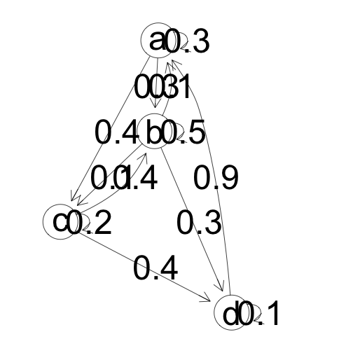

Fix-a-lecture-3b
========================================================
author: Chaman Preet Kaur
date: 4/2/2015

Objectives
========================================================
To understand vectors and matrices further. Topics to be covered:
* Eigenvalues and Eigenvectors
* Markov Matrices
* Steady state diagram
* How to derieve transition state matrix from a state diagram
* What is transpose of matrix
* What is an orthogonal Matrix

Eigenvalues and Eigenvectors 
========================================================

Defination:

We say that a number is the eigenvalue for this square matrix if and only if there exists a nonzero vector x such that 

Ax = λx

where:
A is the square matrix

x is the nonzero vector

λ is a nonzero value

In this circumstance, λ is the eigenvalue and x is the eigenvector.

(source ~ http://anothermathgeek.hubpages.com/hub/What-the-Heck-are-Eigenvalues-and-Eigenvectors)

Markov Matrices
========================================================

A Markov matrix is a square matrix with all nonnegative entries, and where the sum of the en- tries down any column is 1. If the entries are all positive, it’s a positive Markov matrix.

The most important facts about a positive Markov matrix are: 
* λ = 1 is an eigenvalue.
* The eigenvector associated with λ = 1 can be chosen to be strictly positive.
* All other eigenvalues have magnitude less than 1.

(source - http://www.math.utah.edu/~zwick/Classes/Fall2012_2270/Lectures/Lecture40_with_Examples.pdf)

Markov Matrix example
========================================================


```
     [,1] [,2] [,3] [,4]
[1,]  0.3  0.3  0.4  0.0
[2,]  0.1  0.5  0.1  0.3
[3,]  0.0  0.4  0.2  0.4
[4,]  0.9  0.0  0.0  0.1
```


Markov Matrix Grapher/ State diagram
========================================================

 

Transition Matrix
========================================================
 
The transition matrix for the previous steady state diagram would be:
 

```
    a   b   c   d
a 0.3 0.3 0.4 0.0
b 0.1 0.5 0.1 0.3
c 0.0 0.4 0.2 0.4
d 0.9 0.0 0.0 0.1
```

A few other properties of matrices 
========================================================
Transpose of a Matrix:
For a matrix A. Transpose(A) also written A′, Atr, tA or At
Example:

A =

```
     [,1] [,2]
[1,]    1    3
[2,]    2    4
```
Transpose(A) =

```
     [,1] [,2]
[1,]    1    2
[2,]    3    4
```

A few other properties of matrices (contd.)
========================================================

Orthogonal Matrices:

In linear algebra, an orthogonal matrix is a square matrix with real entries whose columns and rows are orthogonal unit vectors (i.e., orthonormal vectors), i.e.

Q^T Q = Q Q^T = I,
where I is the identity matrix

Also, a matrix Q is orthogonal if its transpose is equal to its inverse:

Q^(T)=Q^-1


