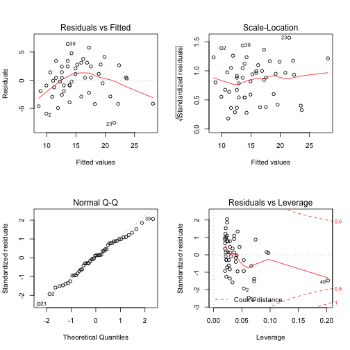
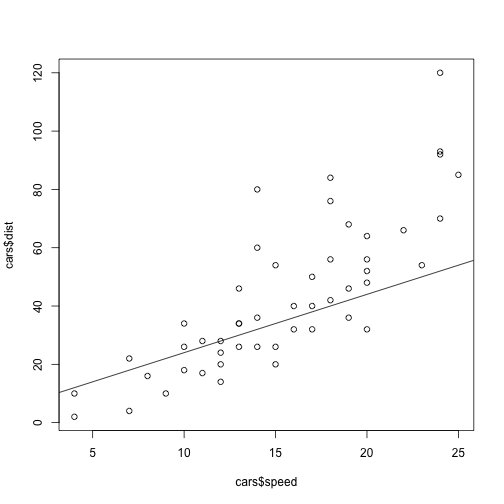

Simple Linear Regression
========================================================
author: Chaman Preet Kaur
date: May 19th, 2015

Simple Linear Regression
========================================================

A simple linear regression model that describes the relationship between 
two variables x and y can be expressed by the following equation. 
The numbers α and β are called parameters, and ϵ is the error term.

y = α + βx+ ϵ

Defining Models in R
========================================================
To complete a linear regression using R it is first necessary to understand the syntax for defining models. Let’s assume that the dependent variable being modeled is Y and that A, B and C are independent variables that might affect Y. The general format for a linear1 model is: 


response ~ op1 term1 op2 term 2 op3 term3...

Defining Models in R
========================================================
Some useful examples

* Y~A, Y=βo +β1A, Straight-line with an implicit y- intercept
* Y ~ -1 + A, Y = β1A, Straight-line with no y-intercept; that is, a fit forced through (0,0)
* Y ~ A + I(A^2), Y = βo+ β1A + β2A2, Polynomial model; note that the identity function I( ) allows terms in the model to include normal mathematical symbols.
* Y~A+B, Y = βo+ β1A + β2B, A first-order model in A and B without interaction terms.
* Y ~ A:B, Y=βo +β1AB, A model containing only first-order interactions between A and B.

Defining Models in R
========================================================

* Y ~ A * B, Y = βo+ β1A + β2B + β3AB, A full first-order model with a term; an equivalent code is Y ~ A + B + A:B.
* Y ~ (A + B + C)^2, Y = βo+ β1A + β2B + β3C + β4AB + β5AC + β6AC, A model including all first-order effects and interactions up to the nth order, where n is given by ( )^n. An equivalent code in this case is Y ~ A * B * C – A:B:C.

Creating A Linear Model
========================================================

The lm() function

In R, the lm(), or "linear model," function can be used to create a simple 
regression model. The lm() function accepts a number of arguments 
("Fitting Linear Models," n.d.). The following list explains the two most commonly 
used parameters.

* formula: describes the model Note that the formula argument follows a specific format. For simple linear regression, this is "Yvariable ~ Xvariable" where Yvariableis the dependent, or predicted, variable and Xvariable is the independent, or predictor, variable.
* data: the variable that contains the dataset

Creating A Linear Model
========================================================

```r
#create a linear model using lm(FORMULA, DATAVAR) We use the built in data set of cars
linearModelVar <- lm( speed ~ dist, cars)
#display linear model
linearModelVar
```

```

Call:
lm(formula = speed ~ dist, data = cars)

Coefficients:
(Intercept)         dist  
     8.2839       0.1656  
```

Summarizing The Model
========================================================

The summary(OBJECT) function is a useful tool. It is capable of generating most of the statistical information that one would need to derive from a linear model.

Summarizing The Model
========================================================


```r
summary(linearModelVar)
```

```

Call:
lm(formula = speed ~ dist, data = cars)

Residuals:
    Min      1Q  Median      3Q     Max 
-7.5293 -2.1550  0.3615  2.4377  6.4179 

Coefficients:
            Estimate Std. Error t value Pr(>|t|)    
(Intercept)  8.28391    0.87438   9.474 1.44e-12 ***
dist         0.16557    0.01749   9.464 1.49e-12 ***
---
Signif. codes:  0 '***' 0.001 '**' 0.01 '*' 0.05 '.' 0.1 ' ' 1

Residual standard error: 3.156 on 48 degrees of freedom
Multiple R-squared:  0.6511,	Adjusted R-squared:  0.6438 
F-statistic: 89.57 on 1 and 48 DF,  p-value: 1.49e-12
```

Summarizing The Model
========================================================

* The section of output labeled ‘Residuals’ gives the difference between the experimental and predicted signals. Estimates for the model’s coefficients are provided along with the their 
standard deviations (‘Std Error’), and a t-value and probability for a null hypothesis that the coefficients have values of zero.

* At the bottom of the table we find the standard deviation about the regression (sr or residual standard error), the correlation coefficient and an F-test result on the null hypothesis that the MSreg/MSres is 1

Other useful commands
========================================================


```r
coef(linearModelVar)  # gives the model’s coefficients
```

```
(Intercept)        dist 
  8.2839056   0.1655676 
```

```r
resid(linearModelVar)   # gives the residual errors in Y
```

```
          1           2           3           4           5           6 
-4.61504079 -5.93958139 -1.94617594 -4.92639228 -2.93298684 -0.93958139 
          7           8           9          10          11          12 
-1.26412199 -2.58866258 -3.91320318 -0.09855441 -1.91979773  1.39814831 
         13          14          15          16          17          18 
 0.40474287 -0.25752743 -0.91979773  0.41133742 -0.91320318 -0.91320318 
         19          20          21          22          23          24 
-2.90001408  1.41133742 -0.24433833 -4.21796012 -7.52931161  3.40474287 
         25          26          27          28          29          30 
 2.41133742 -2.22455467  2.41793197  1.09339137  3.41793197  2.09339137 
         31          32          33          34          35          36 
 0.43771563  2.76225622  0.44431018 -2.86704131 -4.19158191  4.75566167 
         37          38          39          40          41          42 
 3.09998592 -0.54250072  6.41793197  3.76885078  3.10658048  2.44431018 
         43          44          45          46          47          48 
 1.11976958  2.78863443  5.77544533  4.12636413  0.48387749  0.31830992 
         49          50 
-4.15201460  2.64285051 
```
Other useful commands
========================================================

```r
fitted(linearModelVar) # gives the predicted values for Y
```

```
        1         2         3         4         5         6         7 
 8.615041  9.939581  8.946176 11.926392 10.932987  9.939581 11.264122 
        8         9        10        11        12        13        14 
12.588663 13.913203 11.098554 12.919798 10.601852 11.595257 12.257527 
       15        16        17        18        19        20        21 
12.919798 12.588663 13.913203 13.913203 15.900014 12.588663 14.244338 
       22        23        24        25        26        27        28 
18.217960 21.529312 11.595257 12.588663 17.224555 13.582068 14.906609 
       29        30        31        32        33        34        35 
13.582068 14.906609 16.562284 15.237744 17.555690 20.867041 22.191582 
       36        37        38        39        40        41        42 
14.244338 15.900014 19.542501 13.582068 16.231149 16.893420 17.555690 
       43        44        45        46        47        48        49 
18.880230 19.211366 17.224555 19.873636 23.516123 23.681690 28.152015 
       50 
22.357149 
```
Other useful commands
========================================================

```r
layout(matrix(1:4,2,2)) 
plot(linearModelVar)
```

 
Other useful commands
========================================================
* The plot in the upper left shows the residual errors plotted versus their fitted values. The residuals should be randomly distributed around the horizontal line representing a residual error of zero; that is, there should not be a distinct trend in the distribution of points. 
* The plot in the lower left is a standard Q-Q plot, which should suggest that the residual errors are normally distributed. 
* The scale-location plot in the upper right shows the square root of the standardized residuals (sort of a square root of relative error) as a function of the fitted values 
* Finally, the plot in the lower right shows each points leverage, which is a measure of its importance in determining the regression result. 

Using the Results of a Regression to Make Predictions
========================================================

We can use the predict( ) command to do this; the syntax is:

* predict(model, data.frame(pred = new pred), level = 0.95, interval = “confidence”)

where pred is the object containing the original independent variables and new pred is the object containing the new values for which predictions are desired, and level is the desired confidence level.

Adding Regression Lines to Plots
========================================================

```r
plot(cars$speed, cars$dist)
abline(cars$speed, cars$dist)
```

 

(credits: http://www.montefiore.ulg.ac.be/~kvansteen/GBIO0009-1/ac20092010/Class8/Using%20R%20for%20linear%20regression.pdf)


